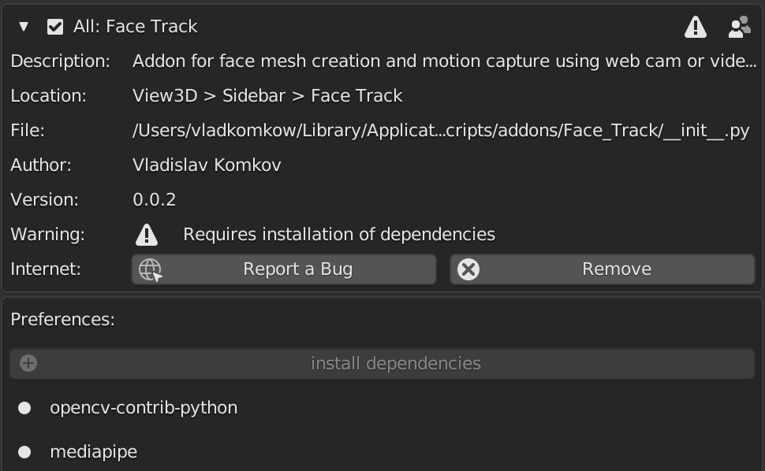
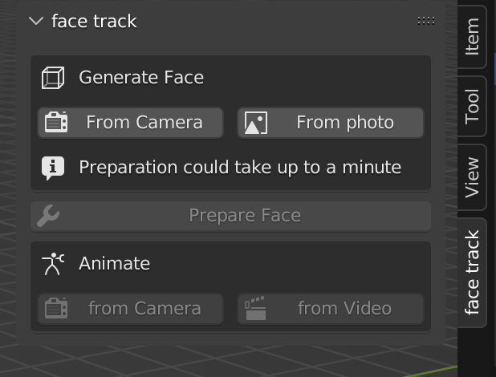

- [Face track](#face-track)
  - [Overview](#overview)
    - [UI](#ui)
    - [Use example](#use-example)
  - [Installation](#installation)
    - [Known Issues:](#known-issues)
    - [less technical overview documentation in czech](#less-technical-overview-documentation-in-czech)
  - [Assignment](#assignment)
  - [Solution](#solution)
    - [External libraries](#external-libraries)
    - [Mediapipe and OpenCV](#mediapipe-and-opencv)
    - [Numpy](#numpy)
    - [Installing libraries into Blender Python](#installing-libraries-into-blender-python)
      - [Overview](#overview-1)
      - [Dependencies solution](#dependencies-solution)
    - [Capturing and processing the face](#capturing-and-processing-the-face)
      - [Bpy operator](#bpy-operator)
      - [Getting image](#getting-image)
      - [Process image](#process-image)
    - [Preparing the face](#preparing-the-face)
      - [Operator](#operator)
      - [Preparing](#preparing)
    - [Recording the animation](#recording-the-animation)
    - [video tracking](#video-tracking)
  - [Sources](#sources)

# Face track

## Overview

Addon for easing face motion caption process up to several minutes for digitalization and animation of the face in the picture

### UI



### Use example
- I recorded [video](./use_example/addon_showreal.mov) in CZ - for better understanding how is add-on working 
- There are also some blend files, but i recomend you to install and try it for yourself


## Installation

Instal like any other blender add-on from preferences.
- open preferencess - addons
- install addon
- select *Face Track.zip*
- enable add-on
- Install dependancies from extended addon preferencies
- Face Track panel should appear in *toolbar* of the *3D View* (shortcut is 'N' for opening tool bar while in *3D View*)
- Enjoy

`!!! Tested on Blender 3.4.0 for Windows !!!`

### Known Issues:

| platform |  possible Issues 	|  possible solution 	|
|--- |---	|---	|
| all |  cv2 wheel fails 	|   blender < 2.93 -> install newer version	|
| all |  permission denied 	|  start blender as Administrator (sudo for linux) while installing dependencies	|
| mac os(arm)  |  mediapipe wheel fails on *apple m1* 	|   *apple arm* processors do not support mediapipe use *intel* | version of **blender**	|
| mac os | problem with camera starting | might be coused by mac trying to use iphone as a webcam |

- If you still have trouble installing dependancies you can install it by hand
  - start blender python **as admin** (in mac os arm, start terminal in Rosetta)
    - find path of executable in blender *script tab* by typing `import sys` `sys.executable`
  - type
  ```
>>> import subprocess
>>> import sys
>>> subprocess.run([sys.executable, '-m','pip', 'install', 'mediapipe', 'opencv-contrib-python'])
  ```

## Assignment

Assignment is consists 3 functional requirement: 
1. Create a mash of the user's face using webcam or image located on the drive.
2. Map texture of the mesh from hte users image.
3. Record face animation using webcam or video located on the drive.

Addon structure:
- Face_Track
  - src
    - all the python implementation
  - all the blender operators and panels
- Face Track.zip debug version of the addon
- reload_sc.sh update debug version
separation is mainly for *testing* and *reusability*

- Modules separation
1. External libraries in addon
2. Capturing and processing the face
3. Preparing the face
4. Recording the animation

## Solution

There I will go through, process of the creating addon, what decisions were made and why. Also will go through each part of the addon separately.

### External libraries

### Mediapipe and OpenCV

All the hardlifting(image processing, face recognition) is on **Mediapipe** libriry by *google*, using **openCV2** in it's core. Using this library, gives a lot of opportunities for tracking not only **face** but for example **hands** or **full body tracking**(tip for the future assignments)

### Numpy

Numpy uses precompiled C++ sources for it's methods, which makes works with arrays faster. In the addon I use it to manage points array

### Installing libraries into Blender Python

#### Overview

Blender Python interpreter includes numpy, but other packages(Mediapipe, openCV) should be downloaded and builded for the system. For this I used:
- **subprocess** python module (for starting new processes from script and track return codes) 
- **pip** for installing packages from internet for the right system
- **pathlib** for working with paths
- **os** for determine executable and blender python modules path

#### Dependencies solution

- I decided to use setting addon pannel for the dependancies manegment
- Adding pannel in the settings is a bit tricky:
  - `bl_idname` - MUST BE same as the module name
  - definition - `class preferences_panel(bpy.types.AddonPreferences)`

- Installing dependancies using `subprosess` you will need:
  - python executable path **!!! depence on the version of the blender !!!** 
  - pip and other commands pass as the params
  - parametr `check = true` will check if the modules was installed correctly
- [reference](./Face_Track/install_dep.py) to the most interesting part
```python
def install(context):
    install_path = None
    
    # Find site-packages directory in all *path* paths
    for i in sys.path:
        if "site-packages" in i:
            install_path = pathlib.Path(i)
            global DEP_PATH
            DEP_PATH = install_path
            break
   
    # Site-packages directory is not in path
    if install_path is None:
        context.report({'INFO'}, "Path not found")
        conf.ShowMessageBox("Error installing dependencies, side-packages path not found, please consider submitting bug report")
        return False
    
    # Make sure pip is installed
    ensure_pip()

    environ_copy = dict(os.environ)
    environ_copy["PYTHONNOUSERSITE"] = "1"

    pyhon_path = get_python_exe()
    if pyhon_path is None:
        conf.ShowMessageBox("Python exe is not found")
        return False

    # Install each package
    for i in range(0, len(conf.package_names)):
        context.report({'INFO'}, "Installing %s" % conf.package_names[i].name)
        conf.package_names[i] = conf.Package(conf.package_names[i].name, conf.package_names[i].installed, True)
        
        # Install module
        try:
            subprocess.run([pyhon_path, '-m', 'pip', "install", '--target', str(install_path), conf.package_names[i].name, ], check=True)
        except subprocess.CalledProcessError:
            conf.ShowMessageBox("Couldn't install dependencies")
            return False

        conf.package_names[i] = conf.Package(conf.package_names[i].name, True, False)
    return True
```

### Capturing and processing the face

#### Bpy operator

- Have classmethods:
  - `execute` - processing the operator
  - `poll` -> bool - determines whether operator is available
  - `invoke` - used for assign properties for execute - good for checking wheather add data is correct

#### Getting image

There are 2 operators for capturing points for the face mesh
- From camera - for capturing face using webcam - [src](Face_Track/add_face.py)
  - operator imports modules (*invoke*)
  - captures image form camera using OpenCV
  - generates face
```python
class addFace_camera(bpy.types.Operator):
    bl_idname = 'mesh.add_face_camera'
    bl_label = 'From Camera'
    bl_options = {"REGISTER", "UNDO"}

    def execute(self, context):
        cv2 = conf.import_module('cv2')
        mp = conf.import_module('mediapipe')
        if cv2 == None or mp == None:
            return
        img = capture_img(cv2)
        face_generator(img, cv2, mp)
        return {"FINISHED"}

    @classmethod
    def poll(cls, context):
        return conf.MODULES_INSTALLED
```

- From photo - for using photo from the computer storage - [src](Face_Track/add_face.py)
- same logic using `ImportHelper` for image capturing

```python
class addFace_photo(bpy.types.Operator, ImportHelper):
    bl_idname = 'mesh.add_face_photo'
    bl_label = 'From photo'
    bl_options = {"REGISTER", "UNDO"}
    filter_glob: StringProperty(
        default='*.jpg;*.jpeg;*.png;*.tif;*.tiff;*.bmp',
        options={'HIDDEN'}
    )
    def execute(self, context):
        cv2 = conf.import_module('cv2')
        mp = conf.import_module('mediapipe')
        if cv2 == None or mp == None:
            return
        img = cv2.imread(self.filepath)
        face_generator(img, cv2, mp)
        return {"FINISHED"}

    @classmethod
    def poll(cls, context):
        return conf.MODULES_INSTALLED
```

#### Process image

- method for generating face mesh - [src](Face_Track/src/add_face_p.py)
  - process_image - process through mediapipe and return mapped vertices
    - mediapipe in case of success returns landmarks relative to the image
    - after we convert coordinates from image space to the world space
  - crop_image - crop image for the texture mapping
    - get face up/left/right/down most points relative to the image
    - crop and write to the addon path
  - create_obj - connects vertices to faces using predefined indices
    - create mesh
    - set vertices/edges/faces from *pydata*
    - move to the separate collection
  - transform - rotates and scales face
    - select only the face
    - translate world origin
    - rotate
    - set shade smooth for good looking mesh
  - unwrap_uv - unwrap with the correct camera angle
    - for changing *3D_VIEW* angle there is no *bpy* method but i did a work around
      - create camera and set it to desired view
      - set view to the camera
      - remove camera
  - create_material - creates material with image texture of cropped face
    - create if not existed

```python
def face_generator(img, cv2, mp):
    # empty image
    if img.shape == (1):
        conf.ShowMessageBox('Image is empty')
        return False
    crop_name = "cropped_face.jpg"
    error, vertices = process_image(img, cv2, mp)
    if error is not None:
        conf.ShowMessageBox(error)
        return False
    if crop_image(img, crop_name, get_limits(vertices), get_addon_path(), cv2) != 0:
        return False
    faces = conf.MESH_FACES
    obj = create_obj(vertices, faces)
    transform(obj)
    unwrap_uv(obj)
    create_material(obj, "face_unwrapped")
    return True
```

### Preparing the face

Rigging active_object(face) and creating empty objects to control the rig

#### Operator

- operator takes active object checks if it was created using addon(using **customProperties**) and prepares face

```python
def execute(self, context):
    obj = bpy.context.active_object
    if obj == None:
        conf.ShowMessageBox("Choose the face you want to prepare")
        return {"FINISHED"}
    if conf.FACE_NAME == obj.name:
        add_empty(obj)
        add_rig(obj)
        hide_rig()
        conf.FACE_PREPARED = True
    else:
        conf.ShowMessageBox("Only faces created with addon are supported")
    return {"FINISHED"}
```

#### Preparing

- [add_empty](/3D/Semestral/Face_track/Face_Track/src/prepare_face_p.py)
  - get coordinates of all the verities
  - at each of them create empty at the separate collection
  - set location and scale
- add_rig
  - creates bones
  - join armatures in correct order
  - parent face to bones
  - add *copy_location* constraint
- hide_rig
  - hides armature for better user experience

### Recording the animation

- This feature uses same image recognition pattern as in capture_photo
- There are also 2 similar operators for processing:
  - webcam capture - reads webcam stream and process frame by frame
    - if the computer is not powerful enough, program will remap keyframes by the avarege fps speed and interpolate between points
  - video capture - for now using same processing method also could be performance issues
  - both operators would call **video_tracking** with parameters

### video tracking
- Interesting part is in loop while cap is open
  - capture image unsuccessful
    - if webcam - not loaded yet
    - if video - stream is ended
  - process image = same as capture image
  - record animation
    - if first frame - just record start position
    - else 
      - calculate delta for the animation
      - add location delta to the tracker point
  - calculate fps(frames per second)
  - retime the animation

```python
while cap.isOpened():
    # Read image
    success, image = cap.read()
    if not success:
        if webcam_input:
            print("Ignoring empty camera frame.")
            continue
        else:
            scale_key_frame = 24 / (fps_sum / frame)
            break
    image.flags.writeable = False
    
    # Process image
    process_image(image, tracker_loc)
    tracker_loc_tmp = tracker_loc

    bpy.context.scene.frame_set(frame)
    # Recording difference between last 2 positions
    if not first:
        tracker_loc = tracker_loc - tracker_loc_old
        for i, tracker in enumerate(trackers):
            # xyz- tracking
            tracker_loc[i] = [-tracker_loc[i][2], tracker_loc[i][0], -tracker_loc[i][1]]
            # xy -tracking
            # tracker_loc[i] = [-tracker_loc[i][2],tracker_loc[i][0],0]

            tracker_loc[i] += tracker.matrix_world.translation
            tracker.location = tracker_loc[i].tolist()

            tracker.keyframe_insert(data_path="location")
    first = False
    # setting new position as the old one
    tracker_loc_old = tracker_loc_tmp

    # fps_counter
    image.flags.writeable = True
    new_frame_time = time.time()
    # Calculating the fps
    fps = 1 / (new_frame_time - prev_frame_time)
    fps_sum += fps
    prev_frame_time = new_frame_time
    # putting the FPS count on the frame
    image = cv2.flip(image, 1)
    if conf.DEBUG:
        cv2.putText(image, text="FPS: %s" % str(int(fps)), org=(10, 30), fontFace=cv2.FONT_HERSHEY_SIMPLEX,
                fontScale=1, color=(100, 255, 0), thickness=1)
    else:
        cv2.putText(image, text="Press space to exit", org=(10, 30), fontFace=cv2.FONT_HERSHEY_SIMPLEX,
                fontScale=1, color=(100, 255, 0), thickness=1)
    cv2.imshow('MediaPipe Face Mesh', image)
    
    # Stop video stream on 'Space' press
    if cv2.waitKey(33) & 0xFF == ord(' '):
        scale_key_frame = 24 / (fps_sum / frame)
        cap.release()
        cv2.destroyAllWindows()
        break
    frame += 1
```
- after that we recorded the positions and calculated fps
- remap keyframes for speed 
```python
def retime_key_frames(trackers, multiplication):
    bpy.ops.object.select_all(action='DESELECT')
    # Need to show to se keyframes in graph_editor
    bpy.data.collections['Trackers'].hide_viewport = False
    # Select all the trackers
    for obj in trackers:
        obj.select_set(True)

    # Change area type
    old_type = bpy.context.area.type
    bpy.context.area.type = 'GRAPH_EDITOR'
    # change interpolation type
    # bpy.ops.graph.interpolation_type(type='CONSTANT')
    # Set pivot to the start
    bpy.context.scene.frame_current = 1
    bpy.context.space_data.pivot_point = 'CURSOR'
    bpy.ops.transform.resize(value=(multiplication, 1, 1))
    # Return area type
    bpy.context.area.type = old_type
    # Hide trackers
    bpy.data.collections['Trackers'].hide_viewport = True
```


## Sources

- [Blender bpy doc](https://docs.blender.org/api/current/index.html)
- [good resource with examples](https://b3d.interplanety.org/en/)
- [mediapipe](https://google.github.io/mediapipe/solutions/face_mesh.html)
- [openCV doc](https://docs.opencv.org/4.x/d6/d00/tutorial_py_root.html)
- Similar addon - well written(I founded it too late) [github](https://github.com/cgtinker/BlendArMocap/tree/development/src/cgt_core)
